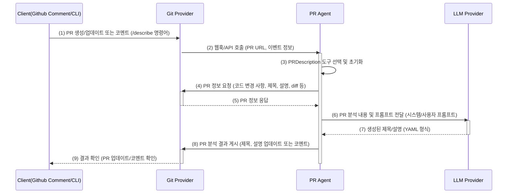
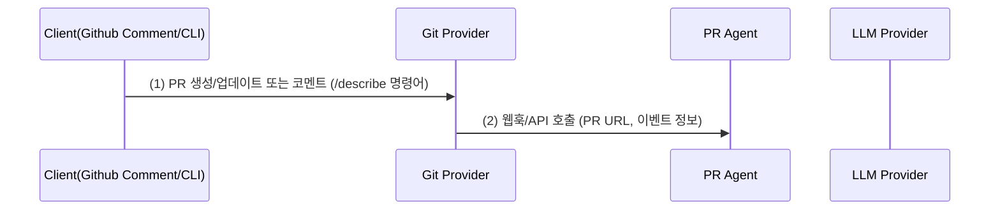
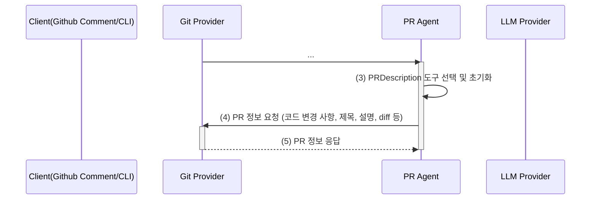
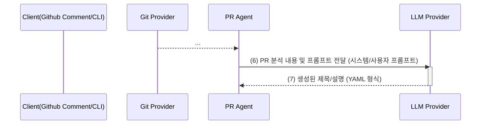
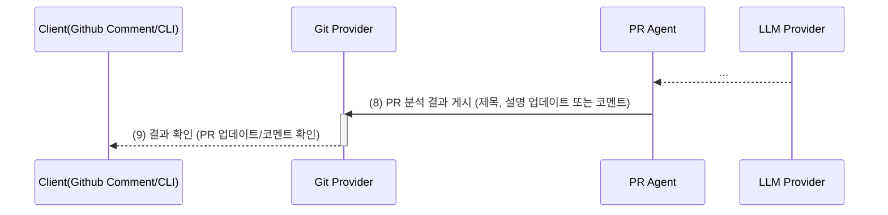

# PR Agent: 10분 안에 훑어보는 `/describe` 명령어

PR Agent는 코드 리뷰 효율을 높이는 도구입니다. 특히, `/describe` 명령어는 PR 제목과 설명을 자동으로 생성하여 개발자의 시간을 절약해줍니다. 마치, 숙련된 동료 개발자가 PR 내용을 쓱 훑어보고 핵심을 짚어주는 것과 같습니다.

`/describe` 명령어가 어떻게 작동하는지 코드 기반으로 분석해보겠습니다.

## I. PR Agent, 시작하기 전에

- Gemini API 키, GitHub 토큰이 필요합니다.
- CLI 환경 설정은 `pr_agent/cli.py`를 참고하세요.

## II. 주요 Task 코드 분석

> 기본 설정과 도구별 코드 및 프롬프트 분석 내용을 요약하여 정리합니다.

PR Agent는 코드 검토 자동화, PR 설명 생성 등 개발 효율성을 높이는 Task를 제공합니다. 주요 Task는 다음과 같습니다.

- `/describe`: PR 제목/설명 자동 생성 및 업데이트
- `/review`: 코드 변경 사항 검토 및 피드백 제공
- `/improve`: 코드 개선 제안

각 Task는 코드 분석, AI 모델 활용, 결과 생성을 거쳐 깃 플랫폼 API를 통해 PR에 결과를 게시하는 방식으로 작동합니다.

## III. `/describe`: PR 설명 자동 생성 과정 분석

`/describe` 명령어는 AI 모델을 활용하여 PR 설명을 자동 생성하는 기능입니다.

깃허브에서 PR을 열고 `/describe` 명령어를 실행했을 때, PR Agent가 어떤 로직으로 PR 코멘트를 작성하는지 코드 기준으로 알아보겠습니다.

전체적인 흐름을 먼저 살펴보고, 각 단계별로 어떤 코드가 실행되고 어떤 일이 일어나는지 자세히 알아보겠습니다.



---

### 1단계. PR 생성/업데이트 또는 코멘트 (/describe 명령어)

> 1-2단계: 외부 트리거로부터 PR Agent 실행



개발자가 PR을 만들거나 업데이트하고, 또는 PR에 `/describe` 명령어를 댓글로 남기면 GitHub는 이를 감지합니다.

### 2단계. 웹훅/API 호출

GitHub는 이벤트(PR 생성, 업데이트, 댓글)를 감지하면 PR Agent 서버에 웹훅 또는 API 호출을 보냅니다. GitHub App의 경우, `handle_new_pr_opened` 함수에서 이 이벤트를 처리합니다.

```py
# pr_agent/servers/github_app.py

async def handle_new_pr_opened(body: Dict[str, Any], ...):

    # 1. 새로운 PR 이벤트를 처리하는 함수
    pull_request, api_url = _check_pull_request_event(action, body, log_context)
    ...

    # 2. PR 이벤트 유효성 검사
    if action in get_settings().github_app.handle_pr_actions:  # ['opened', 'reopened', 'ready_for_review']

        # 3. 설정에 따라 자동 명령 실행 여부 결정
        ...
```

---

### 3단계. PRDescription 도구 선택

> 3-5단계: PRDescription 도구를 선택하고, GitHub 정보로 문맥을 생성



PR Agent 서버는 웹훅/API 호출을 받으면, 해당 요청을 처리할 도구를 선택합니다. `/describe` 명령어이므로, `PRDescription` 도구를 선택합니다.

이 과정은 `PRAgent` 클래스의 `handle_request` 메서드에서 이루어집니다. `handle_request` 메서드는 요청에 맞는 Task를 선택하여 실행합니다.

```py
# pr_agent/agent/pr_agent.py

command2class = {
    "review": PRReviewer,
    "describe": PRDescription,  # <- /describe 호출 트리거
    "improve": PRCodeSuggestions,
    ...
}

class PRAgent:

    # 들어온 요청에 맞는 도구를 선택하고 실행
    async def handle_request(self, pr_url, request, notify=None) -> bool:

        action, *args = request
        # action <- "describe" 할당
        ...

        if action in command2class:
            # PRDescription.run() 호출
            await command2class[action](
                pr_url, ai_handler=self.ai_handler, args=args
            ).run()
        else:
            ...
```

### 4단계. PR 정보 요청

PR Agent는 `/describe` 실행 시, GitHub API를 통해 PR 정보를 요청합니다. 핵심은 코드 변경 사항(diff)인데요, `get_pr_diff` 함수를 통해 가져옵니다.

### 4단계. PR 정보 요청

PR Agent는 `PRDescription.run()` 메서드에서 GitHub API를 통해 PR 정보를 요청합니다.

```py
# pr_agent/tools/pr_description.py

class PRDescription:

    async def run(self):

        await retry_with_fallback_models(self._prepare_prediction, ModelType.WEAK)


    async def _prepare_prediction(self, model: str) -> None:
        ...
        output = get_pr_diff(self.git_provider, self.token_handler, ...)

```

pr_processing 알고리즘 부분으로 들어갑니다.

```py
# pr_agent/algo/pr_processing.py
def get_pr_diff(git_provider: GitProvider, token_handler: TokenHandler, ... ):
    try:
        diff_files = git_provider.get_diff_files()
```

실제 API 연동은 `GithubProvider.get_diff_files()`에서 이루어집니다. GitHub SDK를 통해 diff 파일 목록을 가져옵니다.

```py
# pr_agent/git_provider/github_provider.py
class GithubProvider(GitProvider):
    ...
    def _get_repo(self):
        # 실제 통신이 일어납니다. GitHub SDK를 연결해두었습니다.
        self.repo_obj = self.github_client.get_repo(self.repo)
        return self.repo_obj
```

### 5단계. PR 정보 응답

GitHub API는 diff 정보와 함께 PR 제목, 본문 등 metadata를 응답합니다. `get_pr_description` 메서드는 PR 본문 내용을 가져오는데 사용됩니다.

```py
# pr_agent/git_providers/git_provider.py
def get_pr_description(self, full: bool = True, split_changes_walkthrough=False) -> str or tuple:
    ...
    description = self.get_pr_description_full() if full else self.get_user_description()
    ...
    return description
```

이제 LLM에게 전달할 준비가 거의 끝났습니다!

---

### 6단계. PR 분석 내용 및 프롬프트 전달

> 6-7단계: LLM에게 멋진 글을 만들어달라고 부탁하는 과정



PR Agent는 GitHub로부터 받은 PR 정보와 함께, AI 모델에게 전달할 프롬프트를 생성합니다.

프롬프트는 `pr_description_prompts.toml` 파일에 정의되어 있으며, LLM에게 PR의 내용을 요약하고, 적절한 제목과 설명을 생성하도록 지시하는 역할을 합니다.

이 과정은 `PRDescription` 클래스의 `_get_prediction` 메서드에서 수행됩니다.

```py
# pr_agent/tools/pr_description.py

class PRDescription:
    ...

    async def _get_prediction(self, model: str, patches_diff: str, prompt="pr_description_prompt") -> str:
         # LLM 예측을 얻기 위한 메서드
         variables = copy.deepcopy(self.vars)
         variables["diff"] = patches_diff  # update diff

         environment = Environment(undefined=StrictUndefined)
         system_prompt = environment.from_string(get_settings().get(prompt, {}).get("system", "")).render(self.variables)
         user_prompt = environment.from_string(get_settings().get(prompt, {}).get("user", "")).render(self.variables)

         response, finish_reason = await self.ai_handler.chat_completion(...)
         return response
```

템플릿 엔진을 사용하여 시스템 프롬프트와 사용자 프롬프트를 조합하고, `ai_handler`를 통해 LLM에 전달합니다.

<details>

<summary>pr_description_prompts.toml의 프롬프트 템플릿</summary>

- **System 프롬프트:** LLM에게 역할("PR 전문가")과 목표를 부여합니다.

  ```toml
  [pr_description_prompt]
  system="""You are PR-Reviewer, a language model designed to review a Git Pull Request (PR).
  Your task is to provide a full description for the PR content - type, description, title and files walkthrough.
  ...
  The output must be a YAML object equivalent to type $PRDescription, according to the following Pydantic definitions:
  ...
  """
  ```

  이 시스템 프롬프트는 LLM에게 PR 검토 전문가로서 PR 콘텐츠(유형, 설명, 제목, 파일 개요)를 완벽하게 설명하는 역할을 부여합니다.

- **User 프롬프트:** LLM에게 실제 PR 정보(제목, 설명, 변경 사항 등)를 전달합니다.

  ````toml
  [pr_description_prompt]
  user="""
  ...
  PR Info:

  Previous title: '{{title}}'
  ...
  The PR Git Diff:
  =====
  {{ diff|trim }}
  =====
  ...
  Response (should be a valid YAML, and nothing else):
  ```yaml
  """
  ````

  `{{ diff|trim }}`과 같은 Jinja2 템플릿 변수를 사용하여 PR 정보를 동적으로 프롬프트에 삽입합니다.

</details>

### 7단계. 생성된 제목/설명

LLM은 PR 분석 결과와 프롬프트를 바탕으로 새로운 제목과 설명을 생성하고, 이를 YAML 형식으로 PR Agent에게 반환합니다.

---

### 8단계. 마크다운 형식으로 변환 및 PR 분석 결과 게시

> 8-9단계: 생성한 결과를 GitHub에 게시



PR Agent는 LLM으로부터 받은 YAML 형식의 제목과 설명을 마크다운 형식으로 변환하고, GitHub를 통해 PR에 게시합니다.
`process_pr_files_prediction` 메서드는 파일 목록을 마크다운 테이블로 만들어줍니다.

```py
# pr_agent/tools/pr_description.py

class PRDescription:
    ...

    def process_pr_files_prediction(self, pr_body, value):
        pr_comments = []
        # PR에 관련된 파일 목록을 마크다운 테이블 형식으로 생성
        ...
        try:
            # 하드코딩된 테이블 텍스트들
            pr_body += "<table>"
            header = f"Relevant files"
            delta = 75
            pr_body += f"""<thead><tr><th></th><th align="left">{header}</th></tr></thead>"""
            pr_body += """<tbody>"""

            for semantic_label in value.keys():
                ...
                    pr_body = self.add_file_data(delta_nbsp, diff_plus_minus, file_change_description_br, filename,
                                                  filename_publish, link, pr_body)
                ...

                # Close the collapsible file list
                if use_collapsible_file_list:
                    pr_body += """</table></details></td></tr>"""
                else:
                    pr_body += """</table></td></tr>"""
            pr_body += """</tr></tbody></table>"""

        except Exception as e:
            get_logger().error(f"Error processing pr files to markdown {self.pr_id}: {str(e)}")
            pass

        return pr_body, pr_comments
```

`process_pr_files_prediction` 함수는 LLM이 분석한 파일 목록을 기반으로 마크다운 테이블을 생성하고, PR 설명에 추가합니다.

PR Agent는 설정에 따라 PR 설명을 코멘트로 게시할지, 아니면 PR 자체를 업데이트할지 결정하고, GitHub를 통해 게시합니다.

```py
# pr_agent/tools/pr_description.py

class PRDescription:

    def run(self):
        ...

        if get_settings().config.publish_output:

            if get_settings().pr_description.publish_description_as_comment:

                # Yes, commment로 개시
                self.git_provider.publish_comment(full_markdown_description)
            else:

                # No, 업데이트로 게시
                self.git_provider.publish_description(pr_title, pr_body)
```

### 9단계. 결과 확인

마지막으로, 개발자는 GitHub(GitHub, GitLab 등)에서 PR이 업데이트되거나 새로운 코멘트가 추가된 것을 확인하여 PR 분석 결과를 확인합니다.

## 3. 설정 `configuration.toml`

`/describe` 명령어는 `configuration.toml` 파일의 `pr_description` 섹션에서 설정할 수 있습니다. 주요 설정 옵션은 다음과 같습니다.

- `enable_semantic_files_types`: 의미론적 파일 유형 분석 활성화 여부를 결정합니다.
- `collapsible_file_list`: 파일 목록 접기 기능 사용 여부를 결정합니다.
- `generate_ai_title`: AI가 생성한 제목을 사용할지, 기존 PR 제목을 사용할지 결정합니다.
