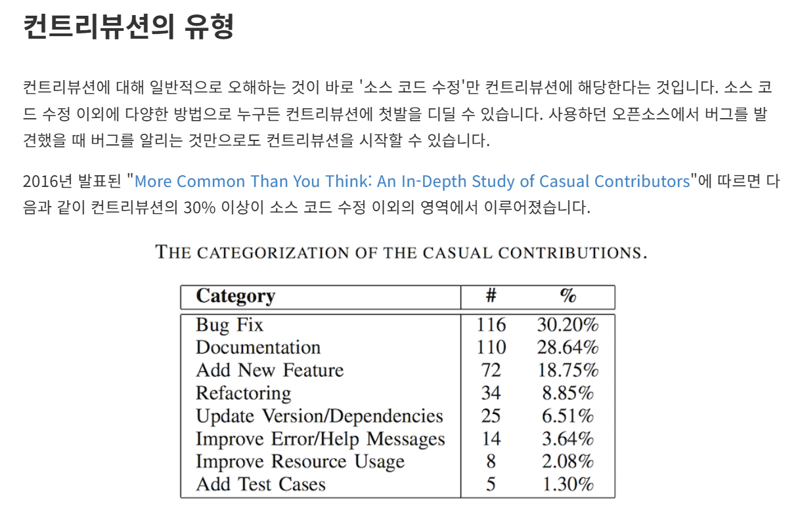
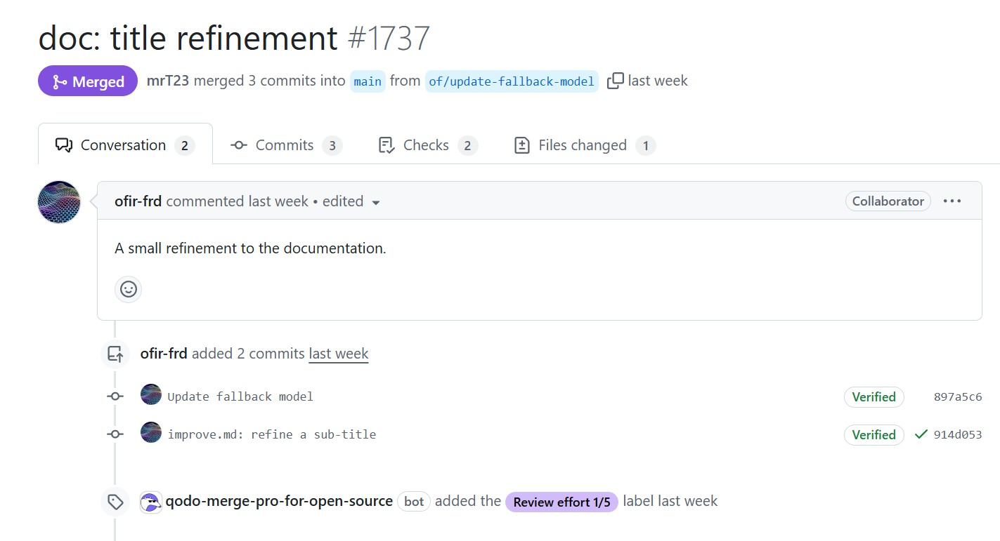
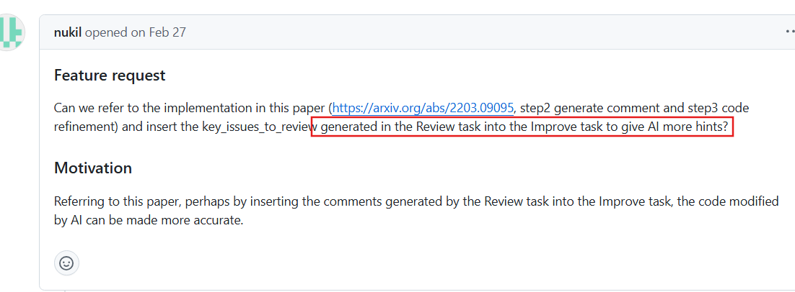
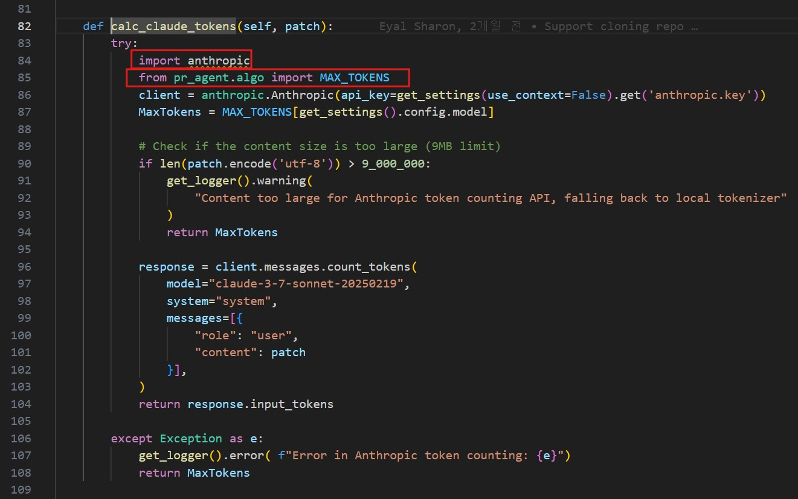
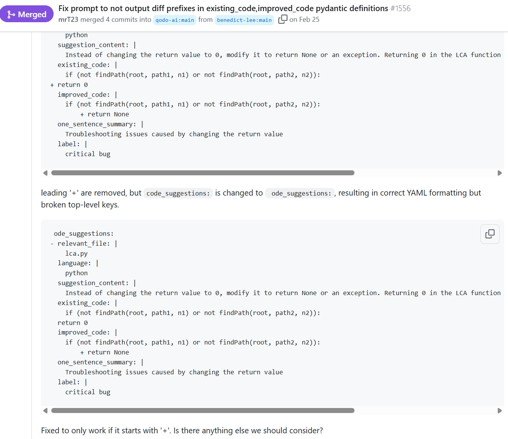
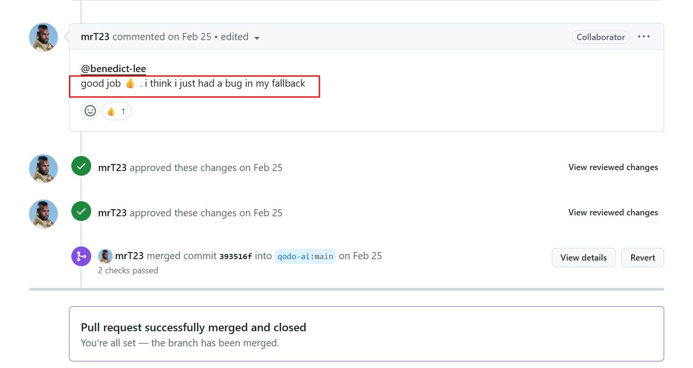
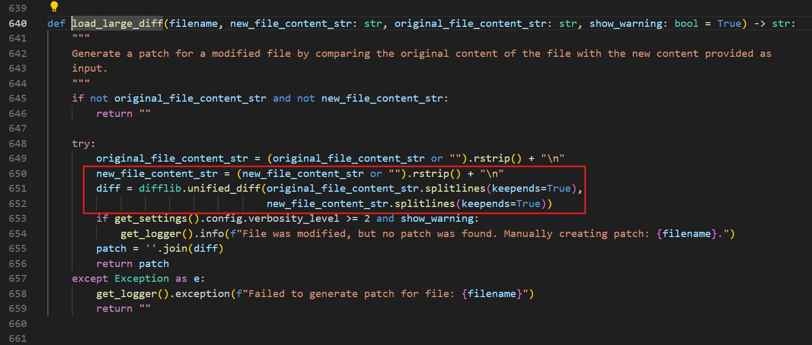
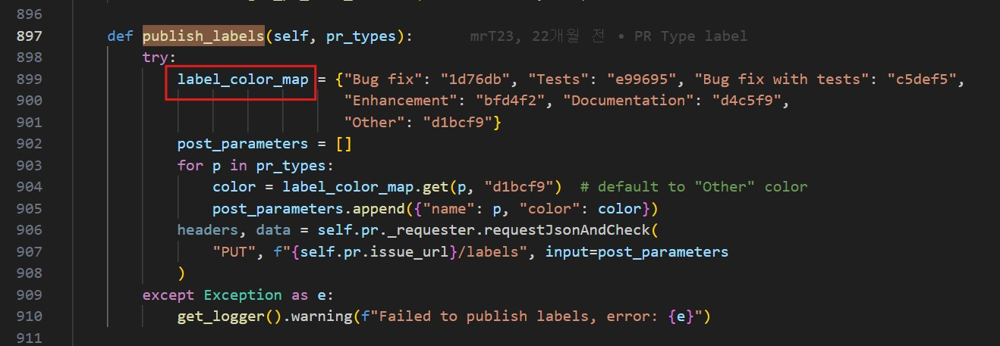

# PR Agent 기여 아이디어 제안 (4주차)

## 🎯 학습 목표

- PR Agent 기여 아이디어 발굴 및 구체화
- PR Agent에 기여할 만한 아이디어 심층 논의
- 선정된 기여 아이디어에 대한 "What, Why, How" 분석 및 정리 (구현 X)

---

## 🛠️ 조별 과제

- 조별 토의를 통해 선정된 Top 3 아이디어 정리 후 PR 작성
- 조별 Top 3 아이디어 발표 (각 10분 내외)
  - 아이디어별 What? Why? How? 상세 설명
    - 향후 2주간의 구체적인 구현 계획 포함

---

## [0] 기여 방향 생각하기

- 2주 안에 실행 가능한 영역 생각하기.
- 불편하거나, 버그인 부분을 발견하면 -> 개선하기.
 
- 단순 오타 / 주석 처리도 가벼운 것이 아니다.
 
- 코드 자체를 수정 / Qodo Merge 유료 기능일 경우 지양한다.
 [#1587 Improve 개선 요청](https://github.com/qodo-ai/pr-agent/issues/1587)
 
 

---

## 🛠️코드 개선🛠️ /algo 디렉터리 내 함수 개선과 테스트케이스 작성

### [1] What?

- PR Agent의 `/algo` 디렉터리 내부에는 수많은 함수가 존재합니다.
  이 중에서 상당수가 '불필요한 반복문 중첩', '예외처리 부족', '메모리 성능 개선'의 필요성이 존재합니다.
- 이러한 부분을 다음 기준으로 기여를 하려고 합니다
  1. 서비스에 영향을 적게 주며
  2. 코드 수정보다 버그 개선 등 부분 위주로
  3. 수정하고 PR 하기
- 또한, 비즈니스 로직에는 존재하지만 `/test/unittest`에는 존재하지 않는 테스트 파일도 존재하는 것으로 보입니다.
  - 함수 효율성 개선과 함께 필요한 테스트 케이스를 함께 제시하려고 합니다.
- (특정 함수 리팩토링이 아닌 다음과 같이 실제 사용해보고 정하려고 합니다.)

---

### 예시 1-1)

### [1] What?

* `/algo/token_handler.py`의 `calc_claude_tokens` 함수 내부에
  `import anthropic` 및 관련 `import` 구문이 아래와 같이 위치해 있음을 확인했습니다. (:84-85 라인)
  

### [2] Why?

  

* **일반적 스타일과 다름**
  Python PEP-8 코딩 스타일 가이드에서는 `import` 문을 파일 최상단에 배치하는 것을 권장하여 가독성 및 의존성 파악을 용이하게 합니다.
* **잠재적 오해 소지**
  함수 호출 시마다 모듈을 로드하는 듯한 오해를 주거나, 코드의 전체적인 의존성 파악을 어렵게 할 수 있습니다.

### [3] How?

* **개선 전 개발자의 의도 파악**
  * **지연 로딩**
    `anthropic` 라이브러리처럼 특정 기능(Claude 모델 토큰 계산)에서만 사용되는 경우, 초기 로딩 시간을 줄이고 필요할 때만 해당 모듈을 로드하기 위한 의도일 수 있습니다.
  * 일반적인 함수 작성 스타일은 아닐 수 있지만 메인테이너가 코드의 직접적인 수정을 선호하지 않는 경향이 있습니다.
  * **개발자의 의도라면 개선 방향 중지**

---

### 예시 1-2)

- [Fix prompt to not output diff prefixes in existing_code,improved_code pydantic definitions #1556](https://github.com/qodo-ai/pr-agent/pull/1556)
 
 
- DEEPSEEK-R1과 사용할 때 yaml 형식이 잘못되는 경우가 발생
- 멘토님: 프롬프트 지시문에 diff 접두사 `+`, `-` 포함하지 말라고 코드 수정해서 해결 시도
- mrT23: `../algo/utils.py`에 이미 `try_fix_yaml` 함수에 기호 제거 로직 구현되어 있음.
- 멘토님: 테스트해보니 `ffith fallback` 로직 자체에 버그가 있음을 발견
- mrT23: 프롬프트를 수정하기보다 기존 로직의 버그를 수정하는 방향으로 Merge 인정

---

### 예시 2)

 

### [1] What?

* **제안 아이디어**
  PR Agent가 Pull Request의 변경 사항을 분석할 때, 큰 파일(예: 수십 MB 이상의 텍스트, 코드, 로그 파일 등)을 처리하는 과정에서 발생할 수 있는 과도한 메모리 사용 문제를 개선하고자 합니다.
  파일 내용을 한 번에 메모리에 모두 로드하는 방식 (`file.read()` 등) 대신,
  **스트리밍(streaming) 또는 청크(chunk) 단위로 파일을 읽고 처리**하는 방식으로 변경하여 메모리 효율성을 높이는 리팩토링을 제안합니다.
  * **파일:** `pr_agent/algo/utils.py`
  * **함수:** `def load_large_diff(...)` (스크린샷 기준 **:640라인** 시작)
  * **주요 개선 필요 지점:**
    * **라인 650-651:** `original_file_content_str.splitlines(keepends=True)` 및 `new_file_content_str.splitlines(keepends=True)`
      * **Why?:**
        이 부분은 이미 메모리에 로드된 전체 파일 내용 문자열을 다시 줄 단위의 리스트로 변환합니다.
        원본 문자열 자체가 크다면, 여기서 생성되는 리스트 또한 큰 메모리를 차지하게 됩니다.
    * **함수 호출부 개선**
      `load_large_diff` 함수에 `original_file_content_str`와 `new_file_content_str`를 전달하는 코드.
      이 문자열들이 생성될 때
      (예: `GitProvider`에서 파일 내용을 `file.read()` 등으로 한 번에 읽어올 경우) 이미 대량의 메모리가 소모될 수 있습니다.

### [2] Why?

* **현재 동작 상태**
  * `GitProvider`가 파일 전체 내용을 문자열로 읽어와 `load_large_diff`에 전달하는 것으로 보입니다.
  * `load_large_diff`는 전달받은 큰 문자열에 대해 내부적으로 `splitlines()`를 호출, 추가적인 메모리를 소모합니다.
  * 이는 대용량 파일 처리 시 `MemoryError` 또는 성능 저하를 유발합니다.
* **문제점**
  * **성능 저하**
    대량의 데이터를 메모리에서 한꺼번에 다루면 응답 속도가 느려지거나 (로컬) 시스템 메모리를 고갈시킬 위험이 있습니다.

### [3] How?

* **핵심 해결 방안:**
  파일 전체를 문자열로 읽고 `splitlines()`를 사용하는 대신, 파일 내용을 **한 줄씩 읽어 처리하는 이터레이터(iterator) 방식**을 `load_large_diff` 함수 및 이 함수에 데이터를 전달하는 부분에 도입합니다.
* **개선 하기**
  1. **`load_large_diff` 함수 시그니처 변경 및 내부 로직 수정**
  2. **파일 내용을 가져오는 `GitProvider` 로직 수정**
* **기대 효과**
  * 대용량 파일 PR도 **안정적으로 처리.**
  * 메모리 사용 최적화로 **시스템 자원 효율성 및 성능을 향상.**

---

## 🔍확장성🔍 GitHub에는 있지만 GitLab에는 없는 기능 추가 (예: Tagging Bot)

---

### [1] What?

* **여러 플랫폼 간 확장성 고려**
  GitHub 환경에서는 자동화 봇(예: 변경된 파일 경로, 코드 내용, PR 제목/본문 키워드 기반 자동 라벨/태그 부착 봇)이 활용 가능하나,
  GitLab 환경에서 PR Agent를 사용할 경우 이러한 자동 태깅 기능이 부족한 것으로 파악됩니다.
  GitLab Merge Request(MR)에 대해 특정 조건
  (예: 수정된 파일 경로, 코드 키워드, MR 제목/설명 키워드 등)을 만족할 경우, 자동으로 관련 태그(GitLab에서는 '라벨' 기능)를 부착해주는 "Tagging Bot" 기능을 PR Agent에 추가할 것을 고려했습니다.
  
* **관련 PR Agent 기능/모듈**
  * `pr_agent/git_providers/gitlab_provider.py` (수정 영역)
  * `pr_agent/tools/` 내 신규 도구 추가 또는 기존 도구 `pr_generate_labels.py` 확장
  * `configuration.toml`에 GitLab 자동 태깅 관련 신규 설정 옵션 추가

* **현재 상태**
  * PR Agent는 GitLab 연동을 지원하지만, GitHub의 "Tagging Bot"처럼 Merge Request 내용이나 조건에 따라 자동으로 라벨(태그)을 다양하게 부착하는 기능은 미비하거나 제한적입니다.
  * 현재 `/generate_labels` 명령어가 존재하지만, 푸시 이벤트나 MR 생성 시점에 자동으로 다양한 조건에 따라 실행되고 태그를 부착하는 포괄적인 "Bot"의 형태는 아닌 것으로 파악됩니다.

### [2] Why?

* **개선 필요성**
  * GitLab 사용자는 MR의 성격(버그 수정, 기능 추가, 문서 작업 등)이나 영향 범위(프론트엔드, 백엔드, 특정 모듈 등)를 나타내는 라벨을 수동으로 부착해야 하는 번거로움이 있습니다.
  * 자동 태깅 부재로 인해 MR 관리 및 검색, 분류의 효율성이 저하될 수 있습니다.
  * GitHub 환경 대비 GitLab 환경에서의 PR Agent 기능적 동등성(parity) 및 사용자 경험 향상이 필요합니다.
  
* **기대 효과**
  * GitLab 사용자의 수동 라벨링 작업 감소.
  * 자동 분류를 통해 프로젝트 관리 용이성 향상.
  * GitLab 환경에서의 PR Agent 활용 가치 증대 및 기능 확장, 이를 토대로
    타 플랫폼에서도 점진적인 확장이 늘어날 것으로 기대합니다.

### [3] How?

* **기술적 접근**
  1. `gitlab_provider.py`를 확장하여 GitLab API를 통해 MR의 라벨을 읽고 쓰는 기능을 구현합니다.
  2. 사용자가 `.pr_agent.toml` 또는 `configuration.toml`을 통해 자동 태깅 규칙을 정의할 수 있도록 설정 옵션을 추가합니다.
     (특정 파일 경로 패턴 변경 시 "frontend" 라벨 부착, "critical-bug" 라벨 부착 등...)
  3. MR 생성 또는 코드 푸시 이벤트 발생 시, 정의된 규칙에 따라 변경 내용을 분석하고 해당하는 라벨을 GitLab API를 통해 MR에 자동으로 추가.
  4. 기존 `/generate_labels` 도구를 확장하거나, 새로운 자동 태깅 전용 도구/로직을 개발합니다.
  5. `/generate_labels` 기능과의 역할 중복 또는 충돌 가능성 검토 및 조정.

---

## [3] 📚문서화📚 오탈자 수정 및 주석 내용 개선

### [1] What?

* **문서 개선**
  PR Agent의 공식 문서(`docs` 디렉토리 내 Markdown 파일, README 등)
  그리고, 함수 내 발견되는 1) 오탈자 2) 문법 오류 3) 설명이 부족한 부분
  등을 찾아 수정하고 보완하여 문서를 향상시키는 것을 제안합니다.

### [2] Why?

* **문제점 개선**
  * 부정확하거나 이해하기 어려운 문서는 새로운 사용자의 프로젝트 이해와 적응을 어렵게 만들고, 기존 사용자에게도 혼란을 줄 수 있습니다.
  * 이는 오픈소스 기여를 활성화하는 데 중요한 역할을 합니다.
* **기대 효과**
  * 사용자들이 PR Agent를 더 쉽고 정확하게 이해하고 사용할 수 있도록 돕습니다.
  * 프로젝트 완성도를 높여 이용자에게 긍정적인 영향을 줍니다.

### [3] How?

* **실제 실습하면서 오탈자 파악**
  1. 앞선 코드 리팩토링 등을 진행하면서 읽게 되는 문서에서 오탈자, 문법 오류, 어색한 표현, 부정확한 내용, 오래된 정보 등을 찾아 목록화합니다.
  2. 일관된 용어와 스타일을 사용하도록 전체적인 통일성을 검토합니다.
  3. 작은 단위로 변경사항을 커밋하고, 가능하다면 각 변경에 대한 명확한 PR 생성합니다. (문서 개선이라면 문서화 내용만 포함)
  4. 잘못된 정보로 수정하지 않도록 주의해야 합니다.

---

## [4] 구현 계획

- 2025-05-11 (일) ~ 05-12 (월)
  - 정기 회의 이후, 발표 내용을 기점으로 세부적인 계획 수립 예정.
  - 05-15 (목) 오프라인 모임을 통해, 문제점 공유 및 해결 방안 모색, 다음 주 계획 점검.
- 1주차 ~ 05-18 (일)
  - Top 아이디어 항목에 대한 분석 및 초기 구현/수정 작업 시작.
  - 작업 진행 시, GitHub Issues에 관련 내용 등록 또는 기존 이슈 참고.
- 2주차 ~ 05-25 (일)
  - 아이디어 구현/개선 작업 마무리 및 테스트.
  - 멘토님, 조원 간 리뷰 및 최종 PR 제출.
